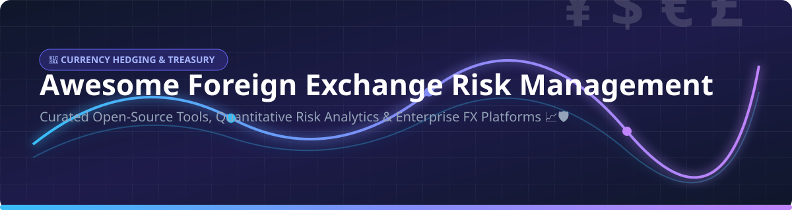

# Awesome Foreign Exchange (FX) Risk Management 💱 Dynamic Currency Hedging & Treasury Tech 🛡️

  
  
  
  

A curated directory of top open-source quantitative finance frameworks, risk analytics toolkits, currency hedging automation systems, and enterprise FX platforms for treasury risk management and cross-border finance. 🚀

> **Primary focus: Open-Source Financial & FX Risk Software.** Commercial SaaS platforms and institutional execution management systems (EMS) are included for enterprise evaluation.

---

## 📋 Table of Contents
- [🏢 SaaS / Hosted Enterprise FX Platforms](#-saas--hosted-enterprise-fx-platforms)
- [🔓 Open-Source FX & Quantitative Risk Platforms](#-open-source-fx--quantitative-risk-platforms)
  - [🧮 Core Quantitative Frameworks & Engines](#-core-quantitative-frameworks--engines)
  - [📊 Specialized FX Libraries & Analytics Tools](#-specialized-fx-libraries--analytics-tools)
- [⚡ Quick Start Recommendations](#-quick-start-recommendations)
- [🤝 Contributing](#-contributing)
- [📈 Star History](#-star-history)

---

## 🏢 SaaS / Hosted Enterprise FX Platforms

*Platforms are sorted descending by estimated company size (market valuation / annual revenue scale).* ⚖️

| Platform | Company Size (Valuation / Annual Revenue) | Description | Key Focus | Pricing (Starting Tier / Basis) | Free Tier / Trial Limits |
|----------|------------------------------------------|-------------|-----------|---------------------------------|--------------------------|
| **[StoneX Treasury](https://www.stonex.com/)** 🏛️ | **$8.4B Market Cap** ($157.7B Revenue) | Institutional treasury and FX services providing global execution, risk management, and liquidity access. | Institutional FX & treasury services | Spread-based pricing included in exchange rate quotes + volume commission based on account tier | No free tier; no free trial (demo account available upon consultation) |
| **[Corpay Cross-Border](https://www.corpay.com/)** 💳 | **$27.5B Market Cap** ($4.5B Revenue) | Cross-border payments, AP automation, and multi-currency accounts with corporate hedging tools. | Cross-border payments + FX risk | Custom transaction fee schedule / exchange rate margin; Corpay One plan starts at 2.9% for credit card bill pay funding | 14-day free trial on Corpay One; no permanent free tier |
| **[Kyriba FX](https://www.kyriba.com/)** ☁️ | **$3.0B Valuation** (~$227M Revenue) | Cloud treasury and finance platform with advanced FX capabilities, cash visibility, and hedge accounting. | Cloud TMS & FX analytics | Enterprise SaaS subscription starting from ~$100,000/year (varies by volume, entities, and module selection) | No free tier; no free trial (sandbox/guided demo provided upon request) |
| **[GTreasury FX](https://www.gtreasury.com/)** 🔐 | **$1.0B Valuation** (~$32M Revenue) | Cloud Treasury Management System (TMS) featuring FX exposure management, derivative strategy, and risk engines. | TMS + FX risk & hedging | Annual enterprise software licensing starting from ~$30,000–$50,000/year based on modules and entity connections | No free tier; no free trial (interactive demo available on request) |
| **[360T](https://www.360t.com/)** 📈 | **~€725M Valuation** (~€102M Revenue) | Multi-bank, multi-asset FX execution management system (EMS) for automated corporate rule-based trading. | Corporate FX execution & EMS | Volume-based trading fees starting from ~€10 per €1 Million traded (pro-rata by asset class/tenor) | No free tier; no public free trial (institutional sandbox access for onboarding) |
| **[Convera](https://www.convera.com/)** 🌐 | **~$628M Revenue Scale** | Global commercial payment provider offering cross-border multi-currency risk management tools. | Cross-border payments & FX | FX exchange rate spread model (zero direct transfer fee options available; custom FX rate margins) | No free tier; free account setup with Price Promise guarantee on cross-border rates |
| **[MillTech FX](https://www.milltechfx.com/)** 🏦 | **$325M Valuation** | FX and payments technology providing multi-bank market access and transparent currency risk tools. | Transparent FX & multi-currency solutions | Fixed fee model (or transparent FX mark-up inclusion) with customized tiering based on annual traded volume | No free tier; customized demo and transaction cost analysis (TCA) available |
| **[Integral](https://www.integral.com/)** ⚙️ | **~$100M Market Valuation Scale** | Institutional FX technology for liquidity aggregation, trade execution, and risk workflow automation. | Liquidity aggregation & FX trading tech | Modular SaaS subscription fee + volume-based MTF execution fee (quoted per million USD traded) | No free tier; demo & custom testing environment available for prospective clients |
| **[Kantox](https://www.kantox.com/)** 🤖 | **~$25M Revenue Scale** | Currency management automation platform offering automated micro-hedging and end-to-end exposure workflows. | Automated FX risk reduction & hedging workflows | Custom annual enterprise agreement starting from ~€10,000/year base platform fee + variable FX margin per trade | No free tier; offers 1-on-1 personalized demo & free FX audit upon request |
| **[FX HedgePool](https://www.fxhedgepool.com/)** 🤝 | **~$10M+ Enterprise Value** | Institutional buy-side peer-to-peer FX matching platform for efficient passive currency hedge execution. | Dedicated FX hedging | Peer-to-peer matching fee / institutional credit-as-a-service fee schedule tailored per fund manager portfolio | No free tier; non-public platform with custom institutional trial/onboarding |

---

## 🔓 Open-Source FX & Quantitative Risk Platforms

*Repositories are sorted descending by GitHub star count.* ⭐

### 🧮 Core Quantitative Frameworks & Engines

| Project | Stars | Description | License | Key Notes |
|---------|-------|-------------|---------|-----------|
| **[microsoft/qlib](https://github.com/microsoft/qlib)** |  | AI-oriented quantitative investment platform covering data processing, strategy backtesting, exposure risk, and portfolio optimization. | MIT | Production-grade AI & quantitative risk framework |
| **[nautechsystems/nautilus_trader](https://github.com/nautechsystems/nautilus_trader)** |  | High-performance Rust & Python event-driven algorithmic trading engine supporting complex FX hedging workflows and risk checks. | LGPL-3.0 | Event-driven FX trading & risk engine |
| **[goldmansachs/gs-quant](https://github.com/goldmansachs/gs-quant)** |  | Goldman Sachs' Python toolkit for quantitative finance, risk analytics, option pricing, and FX derivative calculations. | Apache 2.0 | Institutional-grade risk & pricing toolkit |
| **[QuantLib/QuantLib](https://github.com/QuantLib/QuantLib)** |  | Comprehensive open-source quantitative finance library featuring FX forward/option pricing engines and risk yield curves. | BSD-3-Clause | Standard quantitative finance & pricing engine |
| **[JerBouma/FinanceToolkit](https://github.com/JerBouma/FinanceToolkit)** |  | Transparent financial analysis library for corporate finance, risk metrics, liquidity ratios, and treasury risk calculations. | MIT | Modular treasury analytics framework |
| **[quantopian/pyfolio](https://github.com/quantopian/pyfolio)** |  | Python performance and risk analysis framework for portfolio risk, drawdown analysis, and hedging strategy evaluation. | Apache 2.0 | Portfolio risk & performance tear-sheets |
| **[pmorissette/ffn](https://github.com/pmorissette/ffn)** |  | Financial function library for Python providing quick risk calculations, rebalancing logic, and performance metrics. | MIT | Quantitative helper utilities |
| **[MicroPyramid/forex-python](https://github.com/MicroPyramid/forex-python)** |  | Lightweight Python library for real-time exchange rates, foreign exchange rate conversions, and historical currency rates. | MIT | Currency exchange rate collector |
| **[attack68/rateslib](https://github.com/attack68/rateslib)** |  | Fixed-income and derivative library for cross-currency swaps (XCS), FX swaps, yield curves, and risk sensitivities (delta, cross-gamma). | Source-Available | Advanced quantitative FX & rates toolkit |
| **[eclipse-tradista/tradista](https://github.com/eclipse-tradista/tradista)** |  | Open-source capital markets and treasury system covering trade capture, market data, position P&L, and FX risk management. | Apache 2.0 | Full open-source treasury & FX platform |

---

### 📊 Specialized FX Libraries & Analytics Tools

| Project | Description | Focus Area |
|---------|-------------|------------|
| **Dynamic FX Risk Management Frameworks** | Community repositories implementing volatility regime detection, dynamic options/forwards hedging, and Sharpe optimization. | Hedging simulations |
| **FX Exposure Reconciliation Engines** | Python utilities for multi-source ERP trade matching, break detection, mark-to-market valuations, and cash netting. | Post-trade & operations |
| **Curve & FX Swap Pricing Solvers** | Open-source multi-currency curve builders, cross-currency basis solvers, and forward valuation modules. | Valuation & curves |
| **Portfolio Optimization & Minimum-Variance Solvers** | SciPy and CVXPY optimizers for calculating optimal FX hedge ratios under VaR/CVaR constraints. | Hedge optimization |
| **Corporate FX Dashboarding** | Interactive Streamlit, Dash, and Grafana templates for corporate treasury cash flow and FX exposure visualization. | Dashboarding & UI |

---

## ⚡ Quick Start Recommendations

| Goal | Recommended Option |
|------|--------------------|
| **Enterprise Quantitative FX Risk & Derivative Pricing** | **[goldmansachs/gs-quant](https://github.com/goldmansachs/gs-quant)** or **[QuantLib/QuantLib](https://github.com/QuantLib/QuantLib)** |
| **Full Open-Source Treasury Management System (TMS)** | **[eclipse-tradista/tradista](https://github.com/eclipse-tradista/tradista)** |
| **Algorithmic FX Execution & Risk Engine** | **[nautechsystems/nautilus_trader](https://github.com/nautechsystems/nautilus_trader)** |
| **AI-driven FX Risk & Strategy Modeling** | **[microsoft/qlib](https://github.com/microsoft/qlib)** |
| **FX Swaps, Yield Curves & Risk Sensitivities** | **[attack68/rateslib](https://github.com/attack68/rateslib)** |
| **Fully Automated SaaS Currency Hedging** | **[Kantox](https://www.kantox.com/)** |
| **Enterprise Cloud TMS with FX Risk Module** | **[Kyriba FX](https://www.kyriba.com/)** or **[GTreasury FX](https://www.gtreasury.com/)** |
| **Institutional Multi-Bank Corporate Execution** | **[360T](https://www.360t.com/)** |

---

## 🤝 Contributing

Contributions, corrections, and new open-source projects are welcome! 🛠️  
Please feel free to submit a pull request or open an issue to suggest additions.

---

## 📈 Star History

<a href="https://www.star-history.com/?repos=ishandutta2007%2FAwesome-Foreign-Exchange-Risk-Management&type=date&legend=bottom-right">
<picture>
  <source media="(prefers-color-scheme: dark)" srcset="https://api.star-history.com/chart?repos=ishandutta2007/Awesome-Foreign-Exchange-Risk-Management&type=date&theme=dark&legend=bottom-right" />
  <source media="(prefers-color-scheme: light)" srcset="https://api.star-history.com/chart?repos=ishandutta2007/Awesome-Foreign-Exchange-Risk-Management&type=date&legend=bottom-right" />
  
</picture>
</a>

---

**Last updated:** August 2026 🗓️  
*Documenting open-source frameworks and enterprise FX software for modern corporate treasuries and financial quants.* 💡
